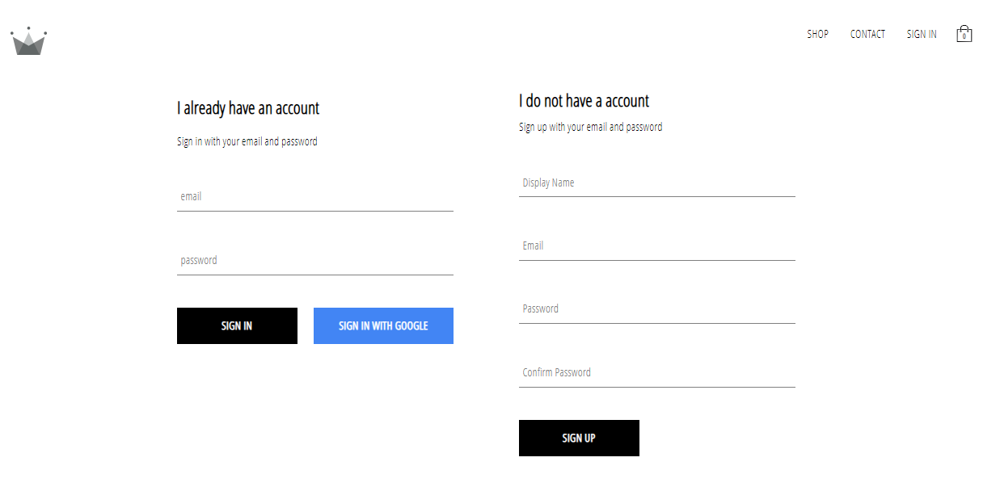

A branded online clothing store marketed towards young adults. Single page web application with reusable components for shopping categories, registering, signing in, checking out, built using React. Routing between components done using React Router. Redux used for scalable state management. Sass used for styling. Integrated with Stripe to handle payments. Firebase utilized for authentication, and Firestore (NoSQL DB) used to store product information and registered user info. Deployed live on Heroku via the Heroku CLI and git. App created in Visual Studio Code with the Yarn package manager. Variations of some components also done later to make use of styled-components. Created as part of a course on React development.

To run:

1. Clone this repo
2. Run `yarn`
3. Run `yarn start`

DEMO SNAPSHOTS:

Home Page: 

User Registration and Sign In:

Different Shopping Categories & Pages:

Adding items to cart, see dropdown:

Checkout Page with Edit Options:

Stripe Payment Component:

Project completed as part of a React development course.
