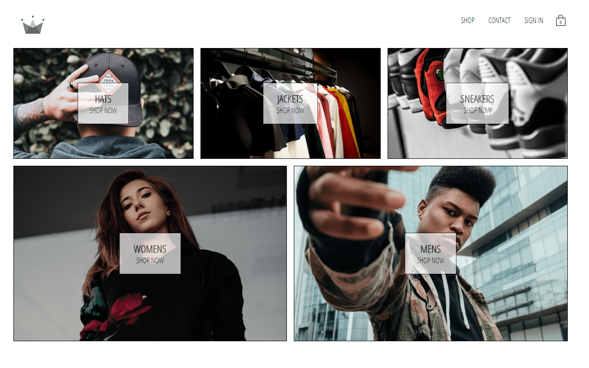

To run:

1. Clone this repo
2. Run `yarn`
3. Run `yarn start`

DEMO SNAPSHOTS:

Home Page: 

Different Shopping Categories & Pages:

Adding items to cart, see dropdown:

Checkout Page with Edit Options:

Stripe Payment Component:

Project completed as part of a React development course.